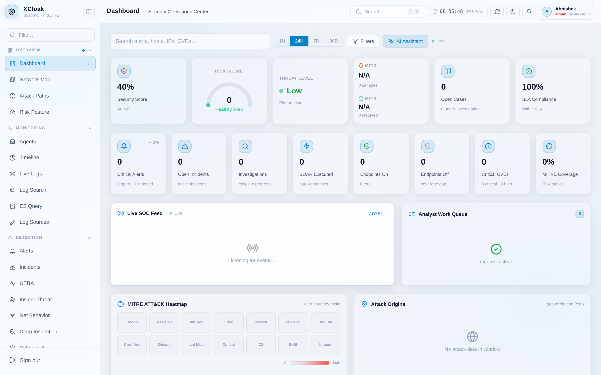
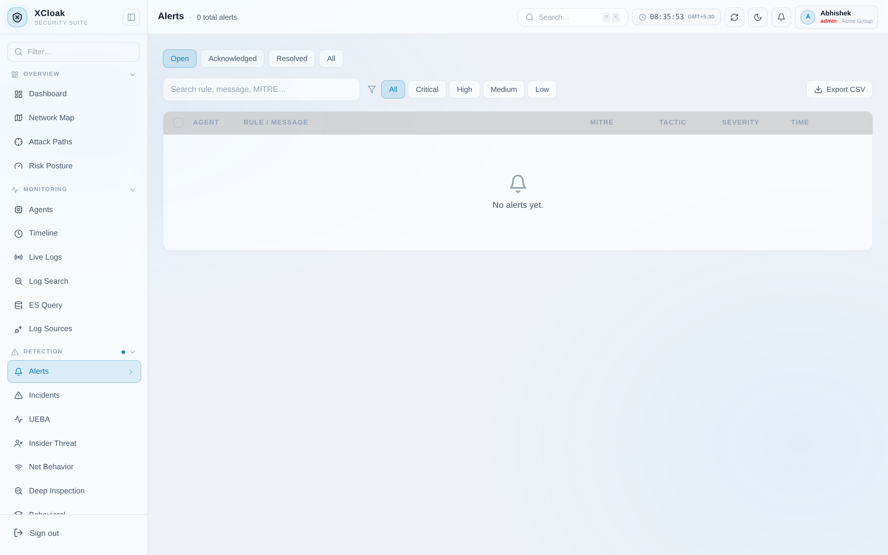
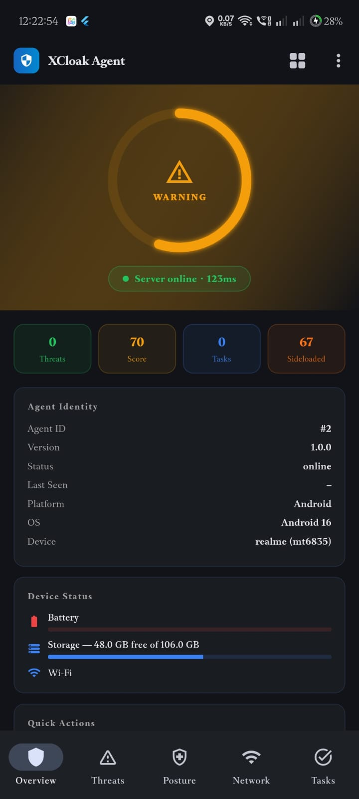

# XCloak Security Suite

[](https://github.com/The-Abhishek1/XCLOAK-SECURITY-SUITE/actions/workflows/build.yml)
[](https://go.dev)
[](https://flutter.dev)
[](charts/xcloak)
[](LICENSE)
[](https://github.com/The-Abhishek1/XCLOAK-SECURITY-SUITE/releases)

**Open-core enterprise security platform.** NGFW + SIEM + EDR + SOAR + MDM in a single stack — built with Go, PostgreSQL, Next.js, and Flutter.

<p>
  <a href="https://xcloak.tech"></a>
  <a href="https://suite.xcloak.tech/demo"></a>
  <a href="https://docs.xcloak.tech"></a>
  <a href="https://blog.xcloak.tech"></a>
</p>

> **Single maintainer project.** This is not a commercial product with an SLA. See [Current Status](#current-status) for an honest picture of what works and what doesn't yet.

---

## Screenshots

| Dashboard Overview | Alert Detail | Posture (Mobile) |
|-------------------|--------------|-----------------|
|  |  |  |

---

## Architecture

```
┌─────────────────────────────────────────────────────────────────────┐
│                         XCloak Platform                              │
│                                                                      │
│  ┌─────────────┐   ┌──────────────────────────────────────────────┐ │
│  │  Next.js 14 │   │           Go / Gin Backend                   │ │
│  │  Dashboard  │◄──┤  Auth · SIEM · SOAR · MDM · Detection        │ │
│  │  Port 3000  │   │  Port 8080                                   │ │
│  └─────────────┘   └──────────┬───────────────────────────────────┘ │
│                               │                                      │
│         ┌─────────────────────┼──────────────────────┐              │
│         ▼                     ▼                      ▼              │
│  ┌─────────────┐   ┌─────────────────┐   ┌─────────────────────┐   │
│  │ PostgreSQL  │   │     Redis       │   │  Kafka (optional)   │   │
│  │ RLS Tenant  │   │  Rate limiting  │   │  Event bus / async  │   │
│  │ Isolation   │   │  Sessions       │   │  7 consumer groups  │   │
│  └─────────────┘   └─────────────────┘   └─────────────────────┘   │
│                                                                      │
│  ┌─────────────────────────────────────────────────────────────┐    │
│  │                    Endpoints                                 │    │
│  │                                                              │    │
│  │  ┌──────────────┐    ┌──────────────┐    ┌──────────────┐  │    │
│  │  │   Go Agent   │    │   Go Agent   │    │ Flutter App  │  │    │
│  │  │    Linux     │    │   Windows    │    │   Android    │  │    │
│  │  │  15 collect. │    │  15 collect. │    │ Agent+Admin  │  │    │
│  │  └──────────────┘    └──────────────┘    └──────────────┘  │    │
│  └─────────────────────────────────────────────────────────────┘    │
└─────────────────────────────────────────────────────────────────────┘
```

**Optional components:** Elasticsearch (dual-write log search), MinIO (WORM audit export), Grafana + Prometheus, HashiCorp Vault (TOTP + secret management)

---

## Current Status

### What works (v0.2.0)

| Component | Status | Notes |
|-----------|--------|-------|
| Backend API | ✅ Production-grade | Go/Gin, 56 migrations, RLS, httpOnly cookies, refresh rotation |
| Detection engines | ✅ Working | 17 behavioral detectors (incl. DPI: DGA, TLS anomaly, HTTP inspection, protocol anomaly), 43 Sigma rules, YARA, IOC |
| Go agent (Linux) | ✅ Production-grade | 15 autonomous collectors, slog, eBPF (optional) |
| Go agent (Windows) | ✅ Working | Same collectors, Windows-native telemetry |
| Mobile agent (Android) | ✅ Working | Posture, MDM, 10 commands, retry backoff, 53-section admin console |
| SOAR / Playbooks | ✅ Working | AI-recommended, human-approval gate, FIM/YARA auto-quarantine |
| Kafka event bus | ✅ Working | 7 consumer groups wired end-to-end |
| Helm chart | ✅ Working | v0.2.0, tested on kind and GKE |
| Multi-tenancy | ✅ Working | PostgreSQL RLS, custom roles, OIDC/SSO |

### Known Limitations

| Limitation | Detail |
|------------|--------|
| **Single maintainer** | Solo project — response times and release cadence reflect this |
| **Frontend open-core** | Next.js dashboard is in this repo (`xcloak-platform/frontend`) but BSL 1.1 licensed |
| **iOS mobile agent** | Does not exist yet — Android only |
| **Screen lock detection** | Requires Device Owner / DPC profile; `has_passcode` is null in BYOD mode |
| **PII in logs** | `parsed_fields` may contain emails/IPs — no automatic masking yet |
| **No third-party pentest** | All security work is internal; external audit not yet scheduled |
| **eBPF requires Linux 5.8+** | Degrades gracefully on older kernels |
| **Certificate pinning off by default** | Can be embedded via ldflags for production builds |

---

## Try It

**[suite.xcloak.tech/demo](https://suite.xcloak.tech/demo)** — live demo, no account needed. Pure Next.js, zero backend, all data baked in.

---

## Running Locally

The platform has three modes depending on what you need:

| | Mode 1 | Mode 2 | Mode 3 |
|---|---|---|---|
| Go backend | ✅ | ✅ | ❌ |
| PostgreSQL | ✅ | ✅ | ❌ |
| Real data | ✅ | ❌ | ❌ |
| Mutations work | ✅ | ✅ | ❌ blocked |
| Netlify-deployable | ❌ | ❌ | ✅ |

### Mode 1 — Real Data & Services (full stack)

Everything live — Go backend, PostgreSQL, Redis, real agent data.

```bash
git clone https://github.com/The-Abhishek1/XCLOAK-SECURITY-SUITE.git
cd XCLOAK-SECURITY-SUITE/xcloak-platform

docker compose up -d
# Frontend: http://localhost:3000
# Backend:  http://localhost:8080
```

First signup creates the admin account. Data comes from your actual database.

### Mode 2 — Demo Data + Real Backend (seeded DB)

Go backend running but pre-seeded with synthetic data. Useful for testing backend features with realistic data without touching production.

```bash
cd XCLOAK-SECURITY-SUITE/xcloak-platform

docker compose -f docker-compose.demo.yml up -d

# Seed demo data (first time only)
docker exec xcloak-demo-backend ./seed-demo

# Frontend: http://localhost:3000 — visit /demo to start a session
```

All API calls go through the real Go backend, but the database has 200 synthetic alerts, 30 agents, incidents, playbook executions, etc.

### Mode 3 — Demo Data, No Backend (static / Netlify)

Pure Next.js, zero backend required. All data is baked into the JS bundle. This is what runs at [suite.xcloak.tech](https://suite.xcloak.tech/demo).

```bash
cd XCLOAK-SECURITY-SUITE/xcloak-platform/frontend
npm install

# Dev (hot-reload):
NEXT_PUBLIC_DEMO_ONLY=true npm run dev

# Production build (what Netlify runs):
NEXT_PUBLIC_DEMO_ONLY=true npm run build
NEXT_PUBLIC_DEMO_ONLY=true npx next start -p 3333
# Visit http://localhost:3333/demo
```

No Docker, no database, no Go binary needed. All demo data (alerts, sigma rules, agents, playbooks, etc.) comes from `lib/demo-data/data.json` via the static router.

### Option B — Kubernetes / Helm

```bash
helm repo add bitnami https://charts.bitnami.com/bitnami

# From this repo
helm dependency update charts/xcloak
helm install xcloak charts/xcloak \
  --namespace xcloak --create-namespace \
  --set global.ingress.host=xcloak.yourdomain.com \
  --set backend.env.JWT_SECRET=$(openssl rand -hex 32) \
  --set backend.env.METRICS_TOKEN=$(openssl rand -hex 32)
```

See [docs/deployment-guide.md](docs/deployment-guide.md) for TLS, Kafka, Elasticsearch, and production hardening.

### Option C — Pre-built binaries (GitHub Releases)

Download from [Releases](https://github.com/The-Abhishek1/XCLOAK-SECURITY-SUITE/releases):
- `xcloak-agent-linux-amd64`
- `xcloak-agent-linux-arm64`
- `xcloak-agent-windows-amd64.exe`
- `xcloak-agent-android.apk`
- `xcloak-*.tgz` (Helm chart)

---

## Feature Overview

### Detection

| Engine | Details |
|--------|---------|
| **Sigma Rules** | 43 production-ready rules seeded automatically; custom rules via UI import or direct migration |
| **YARA Rules** | Malware signature scanning on endpoints; YARA matches auto-create quarantine tasks |
| **IOC Engine** | IP, domain, hash, URL, email; async Kafka matching off the request path |
| **Threat Intel** | STIX/TAXII, MISP, AlienVault OTX, flat-file feeds |
| **C2 Beacon** | CV-based interval analysis on periodic outbound connections (T1071, T1571) |
| **DNS Security** | Multi-factor DGA scoring (entropy + bigrams + TLD + family patterns + NXDOMAIN storm); DNS tunneling; flood detection (T1568.002, T1071.004) |
| **TLS Anomaly** | Weak ciphers (NULL/RC4/EXPORT/DES); deprecated TLS (SSLv3/1.0/1.1); self-signed certs; TLS on wrong ports; SNI/Host domain fronting (T1040, T1090.004, T1571) |
| **HTTP Inspection** | 35+ malicious UA signatures; webshell path detection; path traversal; suspicious methods; high-entropy payloads (T1071.001, T1505.003, T1595) |
| **Protocol Anomaly** | Protocol-on-wrong-port (SSH/SMB/RDP/FTP); DNS tunnel (long labels + TCP volume); ICMP tunnel; HTTP CONNECT lateral movement; SMTP exfil (T1571, T1095, T1572) |
| **Port Scan / LM** | Vertical, horizontal, SYN sweep; SMB spray (T1046, T1021.002) |
| **Exfiltration** | Volume flood, cloud storage drain (S3/Drive/OneDrive/Dropbox/Box/Mega) (T1048, T1567.002) |
| **TLS/JA3** | 13+ known C2 tool fingerprints (Cobalt Strike, Sliver, Havoc, BruteRatel, etc.) (T1071.001) |
| **Credential Attacks** | SSH/RDP brute force, password spray, credential stuffing (T1110.x) |
| **Privilege Escalation** | Windows EventID 4728/4732/4720/4672; Linux sudo/SUID/sudoers (T1098, T1548) |
| **Ransomware** | FIM mass-modify + crypto extensions; kill-chain commands; AV/EDR kill detection (T1486, T1490) |
| **LotL** | Office→PowerShell chains; 10 LOLBins; encoded PowerShell detection (T1059, T1218, T1027) |
| **Impossible Travel** | Haversine distance >900 km/h (T1078) |
| **UEBA** | Behavioral baseline, risk scoring across auth + file access + network |
| **Enterprise Firewall** | Direction-aware rules (in/out/both), port ranges, tags, expiry, per-tenant policy, 12 built-in templates, CIDR conflict detection, atomic agent sync |

### Go Agent — Autonomous Collectors

| Collector | Linux | Windows | Interval |
|-----------|-------|---------|----------|
| Processes | ✅ | ✅ | 30 s |
| Connections (w/ PID) | ✅ `/proc/net` inode→PID | ✅ netstat+tasklist | 30 s |
| Services | ✅ | ✅ | 60 s |
| Users (groups, sudo, SSH, last login) | ✅ | ✅ | 10 min |
| Packages (dpkg/rpm/pacman/snap/flatpak/pip3) | ✅ | ✅ WMIC/registry/winget | 6 h |
| Auth logs | ✅ /var/log/auth.log | ✅ Windows Event Log | 2 min |
| auditd events | ✅ | — | 30 s |
| File hashes | ✅ | ✅ | 1 h |
| FIM (hash+mode+uid+gid+mtime) | ✅ | ✅ | real-time |
| Registry persistence keys | — | ✅ | 1 h |
| Cron jobs / Scheduled Tasks | ✅ | ✅ | 1 h |
| Kernel modules / Drivers | ✅ lsmod | ✅ driverquery | 30 min |
| SUID/SGID binary scan | ✅ | — | 6 h |
| Disk usage | ✅ /proc/mounts | ✅ WMIC/Get-PSDrive | 5 min |
| eBPF TCP events | ✅ (kernel 5.8+) | — | real-time |
| Passive DPI | ✅ SNI + HTTP headers from `/proc/<pid>/fd` | — | per-event |
| Firewall stats | ✅ iptables | — | 60 s |

**Heartbeat:** load_avg_1m/5m/15m, logged_in_users, open_fds (Linux) · cpu_load_pct, logged_in_users (Windows)

### Mobile Agent (Android)

**Device Posture (24 fields sent on every check-in):**
Root detection · Developer options · USB debugging · Unknown sources · Disk encryption · Battery level/charging · Storage total/free · RAM · Network type · WiFi SSID · VPN active · Security patch level · Manufacturer · Hardware · Android SDK · Build fingerprint

**MDM Commands:** `collect_posture` · `collect_apps` · `scan_threats` · `collect_logs` · `sync` · `message` · `rotate_token` · `update_agent` · `lock_screen` (Device Owner) · `wipe` (Device Owner)

**Background timers (all with ≤30 s jitter):** check-in 5 min · command poll 2 min · log forward 10 min · app inventory 30 min · threat scan 15 min

### SOAR / Response

- **Playbooks** — automated chains with human-approval gate before any destructive action
- **AI Recommender** — Claude/Ollama suggests playbook chains from MITRE context
- **FIM auto-quarantine** — critical path violations auto-create pending-approval tasks
- **YARA auto-quarantine** — matched files go into the approval queue
- **Script Runner** — bash/python3 on agents with real-time output
- **Deception** — honeypots, canary tokens, decoy files/users
- **Stale task expiry** — destructive tasks auto-expire after 15 minutes without approval

---

## Comparison

| Feature | XCloak | Wazuh | Elastic Security | Splunk (free tier) |
|---------|--------|-------|-----------------|-------------------|
| SIEM | ✅ | ✅ | ✅ | ✅ |
| EDR (Go agent) | ✅ | ✅ | ✅ | ❌ |
| SOAR / Playbooks | ✅ | ⚠️ basic | ✅ | ⚠️ limited |
| MDM (Android) | ✅ | ❌ | ❌ | ❌ |
| Built-in NGFW rules | ✅ | ❌ | ❌ | ❌ |
| AI triage (LLM) | ✅ Ollama/Claude | ❌ | ⚠️ Elastic AI | ❌ |
| Multi-tenancy | ✅ PostgreSQL RLS | ⚠️ | ✅ | ✅ |
| Helm / K8s | ✅ | ✅ | ✅ | ✅ |
| No Java dependency | ✅ Go-only | ❌ Java/JVM | ❌ JVM | ❌ JVM |
| Open source | ✅ open-core | ✅ | ✅ | ❌ |
| License cost | Free (BSL 1.1) | Free (GPL) | Free tier + paid | Free tier limited |
| Single-binary agent | ✅ | ❌ | ❌ | N/A |
| eBPF support | ✅ | ⚠️ | ⚠️ | N/A |
| Deception technology | ✅ | ❌ | ❌ | ❌ |

> Comparisons are approximate and based on publicly available information as of mid-2026. Each product evolves rapidly.

---

## Documentation

| Guide | Audience |
|-------|---------|
| [docs.xcloak.tech](https://docs.xcloak.tech) | Full documentation site — getting started, API reference, all config |
| [blog.xcloak.tech](https://blog.xcloak.tech) | Technical deep-dives and release posts |
| [Deployment Guide](docs/deployment-guide.md) | Operators — production setup, Kubernetes/Helm, TLS, Kafka, Elasticsearch, MDM |
| [User Guide](docs/user-guide.md) | SOC analysts — alerts, incidents, threat hunting, MDM, AI tools |
| [Agent Deployment](docs/agent-deployment.md) | Sysadmins — installing the Go agent on Linux/Windows |
| [Security Audit Prep](docs/security-audit-prep.md) | Security team — controls inventory, pentest scope, known gaps (Phase 1–8) |
| [Roadmap](roadmap.md) | Everyone — planned features and honest limitations |
| [Changelog](CHANGELOG.md) | Everyone — what changed in each release |
| [Contributing](CONTRIBUTING.md) | Contributors — dev setup, code guidelines, PR process |
| [Security Policy](SECURITY.md) | Everyone — threat model, audit status, responsible disclosure |

---

## Tech Stack

| Layer | Technology |
|-------|-----------|
| Backend | Go 1.25, Gin, golang-migrate (56 migrations) |
| Database | PostgreSQL 16 with Row-Level Security (tenant isolation) |
| Cache / State | Redis 7 (rate limiting, session revocation, Lua atomic scripts) |
| Event bus | Apache Kafka (optional; 7 consumer groups) |
| Object store | MinIO with Object Lock / WORM (audit export) |
| Search | Elasticsearch / OpenSearch (optional dual-write) |
| Metrics | Prometheus + Grafana |
| Secrets | HashiCorp Vault (TOTP encryption, optional secret management) |
| Frontend | Next.js 14 + TypeScript (open-core, not in this repo) |
| Go Agent | Go 1.25, `golang.org/x/sys`, `github.com/cilium/ebpf` (optional) |
| Mobile Agent | Flutter 3.24.5 (Dart), Android API 26+ |
| Infrastructure | Docker Compose (dev), Helm v0.2.0 (production), GitHub Actions (CI/CD) |

---

## Community

| | |
|--|--|
| Website | [xcloak.tech](https://xcloak.tech) |
| Live Demo | [suite.xcloak.tech/demo](https://suite.xcloak.tech/demo) |
| Docs | [docs.xcloak.tech](https://docs.xcloak.tech) |
| Blog | [blog.xcloak.tech](https://blog.xcloak.tech) |
| GitHub | [The-Abhishek1/XCLOAK-SECURITY-SUITE](https://github.com/The-Abhishek1/XCLOAK-SECURITY-SUITE) |
| Issues | [github.com/.../issues](https://github.com/The-Abhishek1/XCLOAK-SECURITY-SUITE/issues) |
| Security | [SECURITY.md](SECURITY.md) — do not open a public issue for vulnerabilities |

---

## License

Business Source License 1.1 — see [LICENSE](LICENSE).

The BSL converts to Apache 2.0 after 4 years (2029). Commercial use beyond the limits described in the LICENSE file requires a separate agreement.

---

## Contributing

See [CONTRIBUTING.md](CONTRIBUTING.md). Bug reports and feature requests use the [issue templates](.github/ISSUE_TEMPLATE/).

Security vulnerabilities → see [SECURITY.md](SECURITY.md). Do not open a public issue.

---

*Maintained by [Abhishek N](mailto:abhishekn1003@gmail.com) · [xcloak.tech](https://xcloak.tech)*
